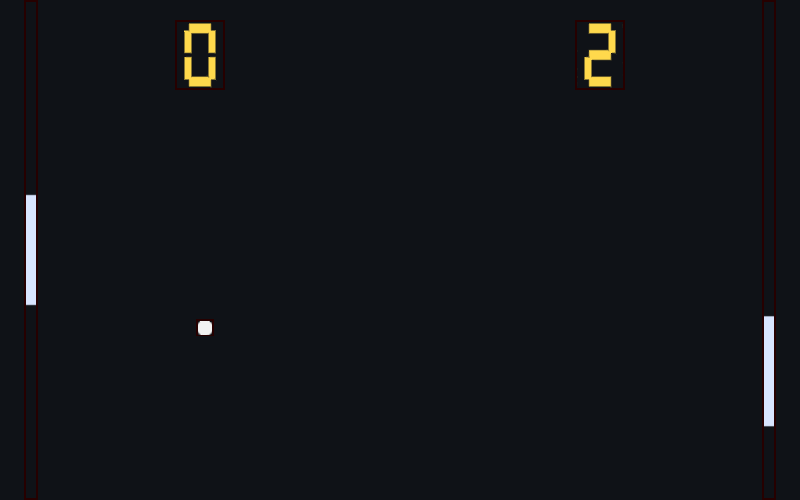

# shad-env

<p align="center">
  
  
</p>

An interface for building graphical applications out of **shader-driven rectangles**.

You define rectangles within a window and bind a fragment shader to each one. Apps
are composed by placing, layering, and feeding inputs to these shader-rects.

## Concepts

- **shad** — a shader bound to a rectangle; the only drawable.
- **shader** — the logic, referenced by handle.
- **texture** — a 2D data source (and a texture can be a render target).
- **buffer** — an array data source (uniforms are just a small prebaked buffer).

Interpreting the texture or buffer is the shader's business.


## Library (`src/lib.rs`)

`ShadEnv` is the whole wgpu side — instance/adapter/device/queue and the compiled
shads. It owns **no** render target: the sole renderer, `render_to(&view, w, h)`,
draws into a view the caller hands it (a winit surface frame, an offscreen
texture, someone else's pass). Surface creation, the swapchain loop, present, and
readback live in the caller, using the exposed `instance()`/`adapter()`/`device()`/
`queue()` handles. Conventions: command/query separation (mutators return only
`Result<(), _>`, queries return values), explicit caller-chosen handles (no
internal ids), and one universal `Bgra8Unorm` target format (`ShadEnv::FORMAT`).

| method | purpose |
|---|---|
| `new()` | build device-level wgpu state (no target) |
| `instance()`/`adapter()`/`device()`/`queue()` | borrow the wgpu handles to build your own target |
| `register_shader(handle, path, hash, validate)` | optionally hash-validate, compile, store |
| `register_texture(handle, rgba, w, h)` | store a 2D data source (raw RGBA8) |
| `register_buffer(handle, bytes)` | store an array data source (raw bytes) |
| `add_shad(handle, shader, corners, z)` | bind a shader to a rect |
| `move_shad(handle, corners, z)` | move/relayer a shad |
| `set_uniform_value(handle, name, val)` | write a named user slot |
| `set_texture(shad, tex)` | bind a texture to a shad (`tex`/`samp`) |
| `set_buffer(shad, buf)` | bind a buffer to a shad (`buf`) |
| `render_to(view, w, h)` | draw all shads (z, then order) into a caller-owned view |

Plus the free fn `read_rgba(device, queue, texture, w, h)` — pull a `COPY_SRC`
target back to CPU RGBA8 (screenshots, tests).

**Shader inputs** (`src/shared.wgsl`): builtins `rect`/`resolution`/`mouse`/`time`;
generic user slots `s0..s3` (scalars) and `v0..v3` (vec4s) via `set_uniform_value`;
plus two unopinionated data sources — `tex` (a `texture_2d`, with `samp`) and `buf`
(`array<u32>`) — bound per-shad via `set_texture`/`set_buffer`. What they *mean* is
the shader's business (font atlas, LUT, string, curves...). Shads that bind neither
get a 1×1 white texture and a 1-element buffer. `register_shader`'s `hash` is the
FNV-1a-64 hex of the file (`content_hash`); when `validate` is true, a mismatch errors out.

See `specs/shad_env_api.rs` for the prototypes + design rules.

## Windowing (`windowed-shad-env/`)

A companion crate that is the deliberate opposite of shad-env's no-target purity:
it **owns** the window, surface, and swapchain loop. An app hands it a
`setup(&mut ShadEnv)` and a per-frame `update(&mut ShadEnv, dt, &Input)` and writes
zero winit/surface code — the wrapper builds the surface from shad-env's handles,
runs the event loop (resize/close/Esc), drives each frame (acquire → update →
`render_to` → present), and supplies dt + a held-key `Input`. It also folds in the
headless `--screenshot [path]` mode (one offscreen frame + `read_rgba` → PNG), with
a `screenshot_warmup(steps, dt)` hook so a deterministic sim lands on a lively frame.

```rust
windowed_shad_env::App::new("title", 800, 500)
    .screenshot_warmup(220, 1.0 / 60.0)
    .run(setup, move |env, dt, input| { /* game logic + shad calls */ });
```

## Examples

- **`examples/pong/`** — a full game: a ball shad moved each frame, full-height
  paddle strips fed their position via uniforms, and 7-segment score digits.

  
- **`examples/hello_world/`** — one shad renders a whole line of text by reading an
  ASCII spritesheet PNG (`tex`, baked by `gen_atlas.py`) and the string's codepoints
  (`buf`), carving its rect into character cells in-shader. Shows off
  `register_texture`/`register_buffer`.

  

Both are built on `windowed-shad-env`, so each `main.rs` is just its `Game`/`setup`/
`update` logic — no winit. Either example's `cargo run -- --screenshot [path]`
renders one frame headlessly to a PNG instead of opening a window — that's how the
images above were made.

Run with `cargo run` from the example's directory.

## Status

Early. Built on [`wgpu`](https://wgpu.rs) (Rust → native + WebGPU).
